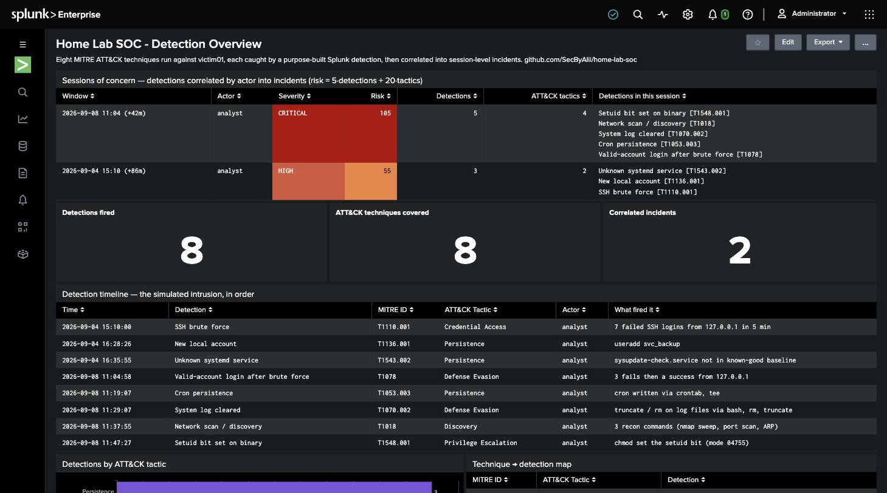

# Home Lab SOC

A self-built detection lab: a Splunk SIEM watching a purpose-built Linux victim host,
eight attacker techniques run against it, and a detection written and tuned for each one
against the **real logs the attack produced**. Every detection is mapped to MITRE ATT&CK
and ships with the false positives it will produce and an honest note on what it doesn't
catch.

**Status:** first-pass build complete — 8 techniques, 8 detections, a session-level
correlation layer, a [writeup](WRITEUP.md), and a dashboard. Extending the library
toward broader ATT&CK coverage is ongoing.

## Why this exists

Most entry-level security portfolios are CTF writeups — they show you can follow an
attack path someone else designed. This is the other side of the console: the part where
alerts fire, most of them are noise, and someone has to decide which one is real.
Watching logs, writing detections, and telling true positives from noise is the
day-to-day of a SOC analyst, and it's what this project demonstrates.

Full narrative, method, and three detailed detection walk-throughs: **[WRITEUP.md](WRITEUP.md)**.

## Dashboard



Every detection wired into one Splunk view: **sessions of concern** at the top
(detections correlated into scored incidents), then the simulated intrusion in
chronological order, each row MITRE ATT&CK-mapped, plus coverage counts and a by-tactic
breakdown. It runs the real detection logic — the `` `soc_detections` `` /
`` `soc_incidents` `` macros in [`dashboards/macros.conf`](dashboards/macros.conf) — not
a separate reporting layer. Source XML:
[`dashboards/soc_overview.xml`](dashboards/soc_overview.xml).

## Detection library

Eight techniques, four detection *shapes*. Recognising which shape a technique needs —
rate, rare-event, allowlist, correlation — is most of the work; the SPL follows once
that's decided.

| # | MITRE ATT&CK | Technique | Detection approach | Files |
|---|---|---|---|---|
| 1 | [T1110.001](https://attack.mitre.org/techniques/T1110/001/) | SSH brute force | rate — ≥5 failures per 5-min window per source IP | [sim](attack-simulations/01-ssh-brute-force.md) · [detection](detections/01-ssh-brute-force.md) |
| 2 | [T1136.001](https://attack.mitre.org/techniques/T1136/001/) | New local account | rare-event — alert on any `useradd` | [sim](attack-simulations/02-create-local-account.md) · [detection](detections/02-new-local-account.md) |
| 3 | [T1543.002](https://attack.mitre.org/techniques/T1543/002/) | systemd persistence | allowlist — service name not in a known-good baseline | [sim](attack-simulations/03-systemd-persistence.md) · [detection](detections/03-new-systemd-service.md) |
| 4 | [T1078](https://attack.mitre.org/techniques/T1078/) | Valid accounts | correlation — a successful login inside a failed-password burst | [sim](attack-simulations/04-valid-accounts.md) · [detection](detections/04-valid-accounts.md) |
| 5 | [T1053.003](https://attack.mitre.org/techniques/T1053/003/) | Cron persistence | auditd — write to a cron path + `crontab` execution | [sim](attack-simulations/05-cron-persistence.md) · [detection](detections/05-cron-persistence.md) |
| 6 | [T1070.002](https://attack.mitre.org/techniques/T1070/002/) | Log truncation / deletion | auditd — destructive op on a protected log file by a login user | [sim](attack-simulations/06-log-clearing.md) · [detection](detections/06-log-clearing.md) |
| 7 | [T1018](https://attack.mitre.org/techniques/T1018/) | Remote system discovery | auditd — scanner binary + argument shape (CIDR, port list) | [sim](attack-simulations/07-remote-discovery.md) · [detection](detections/07-remote-discovery.md) |
| 8 | [T1548.001](https://attack.mitre.org/techniques/T1548/001/) | Setuid/setgid abuse | auditd — `chmod` setting the setuid bit + a process running `euid=0` it wasn't launched as | [sim](attack-simulations/08-setuid-abuse.md) · [detection](detections/08-setuid-abuse.md) |

Each detection file carries the SPL, the result against the real simulated attack, the
false positives to expect, and an "honest gap" section naming what the lab version
doesn't cover.

### Correlation layer

The eight detections are single-signal — each fires independently. A
[correlation layer](detections/session-correlation.md) rolls them up: it normalises
every detection to one row (`` `soc_detections` ``), groups by actor into 90-minute
sessions, and scores each session `5·detections + 20·distinct ATT&CK tactics`
(`` `soc_incidents` ``). Against the lab data the eight raw detections collapse into two
scored incidents — a **CRITICAL** five-detection chain and a **HIGH** three-detection
one — shown as the top panel of the dashboard.

## Architecture

```
┌─────────────────────┐        Splunk Universal Forwarder         ┌──────────────────────┐
│   Ubuntu 26.04 VM    │ ──────────────────────────────────────►  │   macOS host          │
│   victim01 (UTM)     │        auth.log · auditd · syslog         │   Splunk Enterprise    │
│                      │        shipped in real time (:9997)       │   (free tier)          │
│  attacks run here    │                                            │   SPL detections       │
│  auditd rule sets    │                                            │   + dashboard          │
│  loaded per technique│                                            │                        │
└─────────────────────┘                                            └──────────────────────┘
```

Real-time forwarding is the point, not a detail: logs leave the host the moment they're
written, so an attacker with root can't erase what's already off-box. Detection 6
demonstrates why — in one test run, truncating the audit log destroyed the on-disk
record of the other clears in the same run; the forwarded copy is the one that survived.

## How it was built

- **Victim:** Ubuntu Server 26.04 LTS on UTM (ARM-native), on an Apple Silicon Mac.
  Three log sources — `auth.log` (`linux_secure`), the kernel audit log (`linux_audit`),
  and `syslog`.
- **SIEM:** Splunk Enterprise (free tier) on the host; a Universal Forwarder on the VM
  shipping to port 9997.
- **auditd** ships with no rules. File- and process-level visibility is turned on one
  rule set at a time, per technique that needs it, under
  [`detections/audit-rules/`](detections/audit-rules/).
- Attacks follow the documented Atomic Red Team procedure where one exists for the
  technique on Linux; the rest (e.g. T1078) are run manually, noted as such in the sim.
- Full reproduction steps, in build order: [`setup/`](setup/).

## Repo layout

- `setup/` — exact steps to reproduce the lab, in build order
- `attack-simulations/` — each technique run, why it was picked, and the log evidence it produced
- `detections/` — one file per detection (SPL, result, false positives, honest gap),
  plus `session-correlation.md`; `detections/audit-rules/` holds the auditd rule sets
- `dashboards/` — Splunk dashboard source XML and the search macros it runs on
- `screenshots/` — Splunk catching each simulated attack, plus the dashboard
- `WRITEUP.md` — the portfolio writeup

## Skills demonstrated

SIEM configuration and log ingestion · SPL (field extraction, `stats`, time-bucketing,
lookups, multi-record correlation) · MITRE ATT&CK mapping and technique-boundary
reasoning · Linux log sources — `auth.log`, `auditd`, `syslog` · attack simulation with
Atomic Red Team · detection engineering as a discipline — matching a detection shape to
a technique, tuning against real history, documenting every failure mode.
