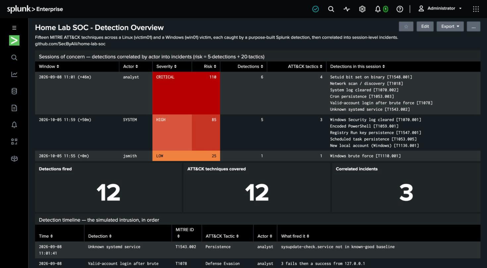

# Home Lab SOC

A self-built detection lab: a Splunk SIEM watching purpose-built **Linux and Windows**
victim hosts, fifteen attacker techniques run against them, and a detection written and
tuned for each one against the **real logs the attack produced**. Every detection is
mapped to MITRE ATT&CK and ships with the false positives it will produce and an honest
note on what it doesn't catch.

**Status:** 15 techniques, 15 detections across two platforms, a session-level
correlation layer, a [writeup](WRITEUP.md), and a dashboard that rolls both hosts into
one view. The original 8 detections target a Linux host; detections 9–15 add a Windows
host (Security log + Sysmon). Extending ATT&CK coverage is ongoing.

## Why this exists

Most entry-level security portfolios are CTF writeups — they show you can follow an
attack path someone else designed. This is the other side of the console: the part where
alerts fire, most of them are noise, and someone has to decide which one is real.
Watching logs, writing detections, and telling true positives from noise is the
day-to-day of a SOC analyst, and it's what this project demonstrates.

Full narrative, method, and three detailed detection walk-throughs: **[WRITEUP.md](WRITEUP.md)**.

## Dashboard



Every detection wired into one Splunk view: **sessions of concern** at the top
(detections correlated into scored incidents), then the simulated intrusion in
chronological order, each row MITRE ATT&CK-mapped, plus coverage counts and a by-tactic
breakdown. It runs the real detection logic — the `` `soc_detections` `` /
`` `soc_incidents` `` macros in [`dashboards/macros.conf`](dashboards/macros.conf) — not
a separate reporting layer. Source XML:
[`dashboards/soc_overview.xml`](dashboards/soc_overview.xml).

## Detection library

Fifteen techniques across two platforms. The same detection *shapes* — rate, rare-event,
allowlist, correlation, command-line pattern, access-mask — recur on both; recognising
which shape a technique needs is most of the work, and several Windows detections are
deliberate twins of a Linux one to show the logic carries while the log source changes
completely.

### Linux victim (`victim01`) — `auth.log`, `auditd`, `syslog`

| # | MITRE ATT&CK | Technique | Detection approach | Files |
|---|---|---|---|---|
| 1 | [T1110.001](https://attack.mitre.org/techniques/T1110/001/) | SSH brute force | rate — ≥5 failures per 5-min window per source IP | [sim](attack-simulations/01-ssh-brute-force.md) · [detection](detections/01-ssh-brute-force.md) |
| 2 | [T1136.001](https://attack.mitre.org/techniques/T1136/001/) | New local account | rare-event — alert on any `useradd` | [sim](attack-simulations/02-create-local-account.md) · [detection](detections/02-new-local-account.md) |
| 3 | [T1543.002](https://attack.mitre.org/techniques/T1543/002/) | systemd persistence | allowlist — service name not in a known-good baseline | [sim](attack-simulations/03-systemd-persistence.md) · [detection](detections/03-new-systemd-service.md) |
| 4 | [T1078](https://attack.mitre.org/techniques/T1078/) | Valid accounts | correlation — a successful login inside a failed-password burst | [sim](attack-simulations/04-valid-accounts.md) · [detection](detections/04-valid-accounts.md) |
| 5 | [T1053.003](https://attack.mitre.org/techniques/T1053/003/) | Cron persistence | auditd — write to a cron path + `crontab` execution | [sim](attack-simulations/05-cron-persistence.md) · [detection](detections/05-cron-persistence.md) |
| 6 | [T1070.002](https://attack.mitre.org/techniques/T1070/002/) | Log truncation / deletion | auditd — destructive op on a protected log file by a login user | [sim](attack-simulations/06-log-clearing.md) · [detection](detections/06-log-clearing.md) |
| 7 | [T1018](https://attack.mitre.org/techniques/T1018/) | Remote system discovery | auditd — scanner binary + argument shape (CIDR, port list) | [sim](attack-simulations/07-remote-discovery.md) · [detection](detections/07-remote-discovery.md) |
| 8 | [T1548.001](https://attack.mitre.org/techniques/T1548/001/) | Setuid/setgid abuse | auditd — `chmod` setting the setuid bit + a process running `euid=0` it wasn't launched as | [sim](attack-simulations/08-setuid-abuse.md) · [detection](detections/08-setuid-abuse.md) |

### Windows victim (`win01`) — Security log + Sysmon

| # | MITRE ATT&CK | Technique | Detection approach | Files |
|---|---|---|---|---|
| 9 | [T1110.001](https://attack.mitre.org/techniques/T1110/001/) | Windows brute force | rate — ≥5 failed logons (event 4625) per 5-min window *(Linux det 1 twin)* | [sim](attack-simulations/09-windows-brute-force.md) · [detection](detections/09-windows-brute-force.md) |
| 10 | [T1136.001](https://attack.mitre.org/techniques/T1136/001/) | New local account | rare-event — any account creation (event 4720) *(Linux det 2 twin)* | [sim](attack-simulations/10-windows-new-account.md) · [detection](detections/10-windows-new-account.md) |
| 11 | [T1053.005](https://attack.mitre.org/techniques/T1053/005/) | Scheduled task persistence | rare-event — task created (event 4698) + Sysmon corroboration | [sim](attack-simulations/11-scheduled-task.md) · [detection](detections/11-scheduled-task.md) |
| 12 | [T1547.001](https://attack.mitre.org/techniques/T1547/001/) | Registry Run key persistence | location watch — Sysmon 13 write to a `…\CurrentVersion\Run\` key | [sim](attack-simulations/12-run-key-persistence.md) · [detection](detections/12-run-key-persistence.md) |
| 13 | [T1059.001](https://attack.mitre.org/techniques/T1059/001/) | Encoded PowerShell | command-line pattern — Sysmon 1 with `-EncodedCommand` | [sim](attack-simulations/13-encoded-powershell.md) · [detection](detections/13-encoded-powershell.md) |
| 14 | [T1070.001](https://attack.mitre.org/techniques/T1070/001/) | Clear Windows event log | rare-event — Security log cleared (event 1102) *(Linux det 6 twin)* | [sim](attack-simulations/14-clear-event-log.md) · [detection](detections/14-clear-event-log.md) |
| 15 | [T1003.001](https://attack.mitre.org/techniques/T1003/001/) | LSASS credential-dump access | access-mask — Sysmon 10 handle to `lsass.exe` with dump rights | [sim](attack-simulations/15-lsass-access.md) · [detection](detections/15-lsass-access.md) |

Each detection file carries the SPL, the result against the real simulated attack, the
false positives to expect, and an "honest gap" section naming what the lab version
doesn't cover.

**Detection 15 is the most instructive.** The real LSASS-dump access was *blocked by the
OS* — this Windows 11 build runs LSASS as a protected process by default, so the dump
handle is denied and no event fires. That's defense-in-depth working: a control that
pre-empts the detection. The detection logic is validated, and the writeup covers both
the rule and why it didn't fire live. Sysmon setup for the Windows detections:
[`detections/sysmon-config.md`](detections/sysmon-config.md).

### Correlation layer

The detections are single-signal — each fires independently. A
[correlation layer](detections/session-correlation.md) rolls them up: it normalises
every detection to one row (`` `soc_detections` ``), groups by actor into 90-minute
sessions, and scores each session `5·detections + 20·distinct ATT&CK tactics`
(`` `soc_incidents` ``). Across both hosts the raw detections collapse into a handful of
scored incidents — a **CRITICAL** five-detection Linux chain and a **HIGH** five-detection
Windows chain among them — shown as the top panel of the dashboard.

## Architecture

```
┌─────────────────────┐   Splunk Universal Forwarder
│  Ubuntu 26.04 VM     │   auth.log · auditd · syslog ─┐
│  victim01 (UTM)      │   (real time, :9997)          │
└─────────────────────┘                                │     ┌──────────────────────┐
                                                        ├───► │  macOS host           │
┌─────────────────────┐   Splunk Universal Forwarder   │     │  Splunk Enterprise    │
│  Windows 11 VM       │   Security · System · Sysmon ──┘     │  (free tier)          │
│  win01 (UTM)         │   (real time, :9997)                 │  SPL detections +     │
└─────────────────────┘                                       │  one dashboard,       │
                                                              │  both hosts           │
                                                              └──────────────────────┘
```

Real-time forwarding is the point, not a detail: logs leave the host the moment they're
written, so an attacker can't erase what's already off-box. Both platforms prove it —
Linux detection 6 (`truncate` on the audit log) and Windows detection 14 (`wevtutil cl
Security`) each destroyed local evidence that was already safe in Splunk.

## How it was built

- **Linux victim (`victim01`):** Ubuntu Server 26.04 LTS on UTM (ARM-native), Apple
  Silicon Mac. Log sources `auth.log` (`linux_secure`), the kernel audit log
  (`linux_audit`), and `syslog`. `auditd` ships with no rules; file/process visibility is
  turned on one rule set at a time, per technique, under
  [`detections/audit-rules/`](detections/audit-rules/).
- **Windows victim (`win01`):** Windows 11 Pro ARM64 on UTM, unattended-installed, on the
  same network and indexer. Log sources: Security log, System log, and Sysmon
  (SwiftOnSecurity config + one ProcessAccess tuning). Build and gotchas:
  [`setup/04-windows-victim.md`](setup/04-windows-victim.md).
- **SIEM:** Splunk Enterprise (free tier) on the host; a Universal Forwarder on each VM
  shipping to port 9997, index `main`.
- Attacks follow the documented Atomic Red Team procedure where one exists; the rest are
  run manually and noted as such in the sim.
- Full reproduction steps, in build order: [`setup/`](setup/).

## Repo layout

- `setup/` — exact steps to reproduce the lab, in build order (Linux + Windows)
- `attack-simulations/` — each technique run, why it was picked, and the log evidence it produced
- `detections/` — one file per detection (SPL, result, false positives, honest gap),
  plus `session-correlation.md`; `audit-rules/` (Linux auditd) and `sysmon-config.md` (Windows)
- `dashboards/` — Splunk dashboard source XML and the search macros it runs on
- `screenshots/` — Splunk catching each simulated attack, plus the dashboard
- `WRITEUP.md` — the portfolio writeup

## Skills demonstrated

SIEM configuration and multi-host log ingestion · SPL (field extraction, `stats`,
time-bucketing, lookups, multi-record correlation) · MITRE ATT&CK mapping and
technique-boundary reasoning · **Linux** log sources (`auth.log`, `auditd`, `syslog`) and
**Windows** log sources (Security event log, Sysmon — process, registry, process-access) ·
recognising the same detection shape across platforms · attack simulation · detection
engineering as a discipline — matching a detection shape to a technique, tuning against
real history, and documenting every failure mode, including when an OS control makes a
detection moot (LSASS / detection 15).
