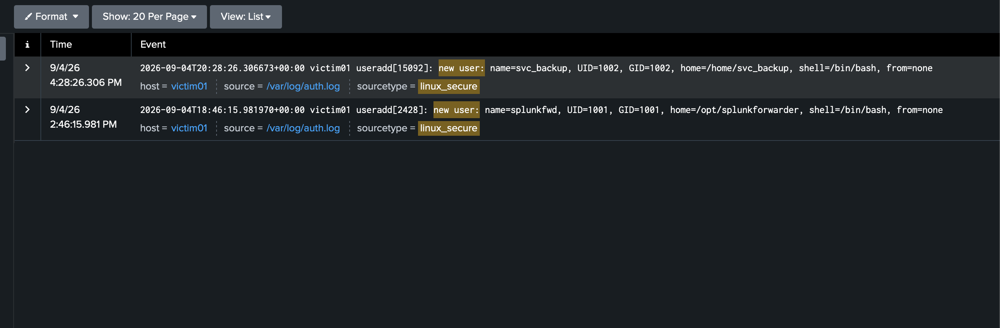

# Detection 2 — New Local Account Created

**MITRE ATT&CK:** T1136.001 — Create Account: Local Account
**Attack simulated:** `attack-simulations/02-create-local-account.md`
**Log source:** `linux_secure` (`/var/log/auth.log`)

## The search

```spl
index=main sourcetype=linux_secure "new user:"
| rex field=_raw "new user: name=(?<new_username>[^,]+), UID=(?<uid>\d+), GID=(?<gid>\d+), home=(?<home_dir>\S+), shell=(?<shell>\S+)"
| rex field=_raw "^\S+ \S+ useradd\[\d+\]"
| table _time host new_username uid home_dir shell
```

Pulls every account-creation event out of auth.log with the username, UID, home
directory, and shell parsed into their own fields — not just "something happened,"
but exactly who got created and with what.

## What it catches

Every `useradd` invocation on the box, full stop. Against the simulated attack:
one row, `new_username=svc_backup`, `uid=1002`.

Running this against the real lab data turned up a second row for free:
`splunkfwd`, UID 1001 — the account the Splunk Universal Forwarder itself created
during install, hours before the simulated attack. Real proof the detection's rare-event
design works both directions: it caught the attack, and it caught the one legitimate
account-creation event already sitting in this VM's history, without needing a single
tuning pass.

## Why this one doesn't need a threshold

Unlike the brute-force detection, this isn't a "5+ in 5 minutes" pattern — it's a
**rare-event** detection. In a single-user home lab (and in most small real
environments), new local account creation is infrequent enough that every single
occurrence is worth a human look. Alert on count, not rate: `count > 0` in the search
window is the whole rule.

## False positives to expect

- **Legitimate provisioning.** A sysadmin actually onboarding a new employee or a
  configuration-management tool (Ansible, Puppet) creating a service account will trip
  this identically. This detection's job isn't to prove malice — it's to surface every
  account-creation event so a human can make that call, which is exactly right for a
  rare, high-signal event like this one.
- **UID range matters in a real environment.** System/service accounts usually land
  under UID 1000; interactive user accounts start at 1000. `svc_backup` landed at 1002
  — inside the normal interactive-user range despite the service-sounding name, which
  is itself a small inconsistency worth teaching a detection to flag in a larger
  environment (a "service account" that isn't actually in the service UID range).

## Screenshot


