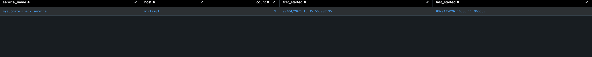

# Detection 3 — New/Unrecognized systemd Service Started

**MITRE ATT&CK:** T1543.002 — Create or Modify System Process: Systemd Service
**Attack simulated:** `attack-simulations/03-systemd-persistence.md`
**Log source:** `syslog` (`/var/log/syslog`)

## The search

```spl
index=main sourcetype=syslog "systemd[1]: Starting"
| rex field=_raw "Starting (?<service_name>\S+) - "
| lookup known_services.csv service_name OUTPUT is_known
| where isnull(is_known)
| stats count earliest(_time) as first_started latest(_time) as last_started by service_name host
| convert ctime(first_started) ctime(last_started)
```

Uses a lookup table (`known_services.csv`, one column: `service_name`) rather than an
inline list — with ~90 legitimate services on even a minimal Ubuntu install (boot
infrastructure like `dracut-*`, `systemd-*`, `snapd*`, `cloud-init*`, plus this box's
own `auditd.service`/`SplunkForwarder.service`), a lookup table is the only
maintainable way to manage the baseline. Built by capturing every service name that
had legitimately started on this VM *before* the attack ran:

```
grep -oP 'Starting \K\S+(?= - )' /var/log/syslog | sort -u > known_services.csv
```

then uploading that as a lookup in Splunk (Settings → Lookups → Lookup table files).

## What it catches

Any systemd service starting that isn't on the known-good list this environment was
baselined against during setup. Against the simulated attack: one row,
`service_name=sysupdate-check.service` — a name that was never part of this VM's
original install and never appeared before the attack ran.

## Why an allowlist instead of a rate/threshold rule

Unlike brute force (attack 1, a rate problem) or new accounts (attack 2, a rare-event
problem), this is an **identity problem** — the question isn't "how often" or "how
many," it's "have I ever seen this specific thing before." An allowlist of known
services is the direct way to ask that question in a single-host lab.

## False positives to expect — and the real cost of this approach

- **Every legitimate software install trips this** until its service name is added to
  `known_services.csv`. `auditd.service` and `SplunkForwarder.service` are only in
  the baseline because they were captured *after* installing them earlier in this
  build — install anything new on this box going forward and its first start will
  flag exactly like `sysupdate-check.service` did, correctly, until the lookup is
  updated.
- **A snapshot baseline only works for one hand-built box with a known install
  history.** It correctly caught the attack here because nothing else changed between
  the snapshot and the attack. A real fleet would maintain this per golden image, or
  replace the static baseline with a first-time-seen search against a long rolling
  history — noted here as the honest next step, not implemented in this lab.

## Screenshot


