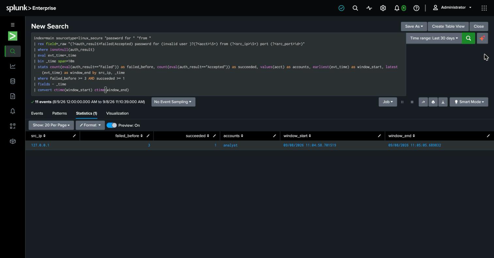

# Detection 4 — Successful Login After a Failed-Password Burst

**MITRE ATT&CK:** T1078 — Valid Accounts
**Attack simulated:** `attack-simulations/04-valid-accounts.md`
**Log source:** `linux_secure` (`/var/log/auth.log` via the Splunk forwarder)

## The search

```spl
index=main sourcetype=linux_secure "password for " "from "
| rex field=_raw "(?<auth_result>Failed|Accepted) password for (invalid user )?(?<acct>\S+) from (?<src_ip>\S+) port (?<src_port>\d+)"
| where isnotnull(auth_result)
| eval evt_time=_time
| bin _time span=10m
| stats count(eval(auth_result=="Failed")) as failed_before,
        count(eval(auth_result=="Accepted")) as succeeded,
        values(acct) as accounts,
        earliest(evt_time) as window_start,
        latest(evt_time) as window_end
        by src_ip, _time
| where failed_before >= 3 AND succeeded >= 1
| fields - _time
| convert ctime(window_start) ctime(window_end)
```

## What it catches

A source IP that racks up 3+ failed SSH password attempts **and** gets at least one
`Accepted password` inside the same 10-minute bin. That combination is the signature of
a guessing attack that succeeded — the point where T1110 becomes T1078.

Against the simulated attack:

| src_ip | failed_before | succeeded | accounts | window_start | window_end |
|---|---|---|---|---|---|
| 127.0.0.1 | 3 | 1 | analyst | 2026-09-08 11:04:58 | 2026-09-08 11:05:05 |

The Sept 4 brute-force run (attack 1) correctly does **not** appear here — it was 7
failures with no success, so it stays the property of detection 1. This search only
fires when someone actually got in.

## How this differs from detection 1

Detection 1 answers "is someone guessing?" — it bins failures and alerts on volume.
This one answers "did the guessing work?" — it needs a success event in the same window
as the failures. Same raw log source, opposite half of the question: detection 1 is the
warning, detection 4 is the incident.

The two are deliberately separate rules rather than one combined search. Detection 1
has to fire on an in-progress attack, before any success exists to correlate against.
Detection 4 is the escalation that pages someone.

## False positives to expect

- **A real user who mistypes a few times, then gets it right.** This is the main one.
  Three fat-fingered attempts followed by a correct login from a normal workstation is
  ordinary behavior. Mitigations in a real deployment: raise `failed_before`, allowlist
  known-good source IPs, or gate the alert on the source IP being one that detection 1
  already flagged in a wider window.
- **A user coming back to a session after a password change** can produce a similar
  failure-then-success shape against cached credentials. Cross-checking whether a
  `passwd` / `chage` event for that account preceded the burst rules this in or out.

## Threshold notes

`failed_before >= 3` and a 10-minute bin are lab starting points. The bin is wider than
detection 1's 5 minutes on purpose — a real attacker often pauses between the guessing
phase and coming back to use the credential, and too tight a window would split the
failures and the success into separate bins and miss the correlation. A tuned
deployment would baseline both numbers against real login traffic first.

## Honest gap

This only catches T1078 when it arrives **through** a visible guessing burst. A login
on a credential that was phished or reused — no failures at all — sails straight past
this rule. Catching that case needs a behavioral baseline per account (usual source
IPs, usual hours, key vs. password auth) and is the natural next detection to build.

## Screenshot


