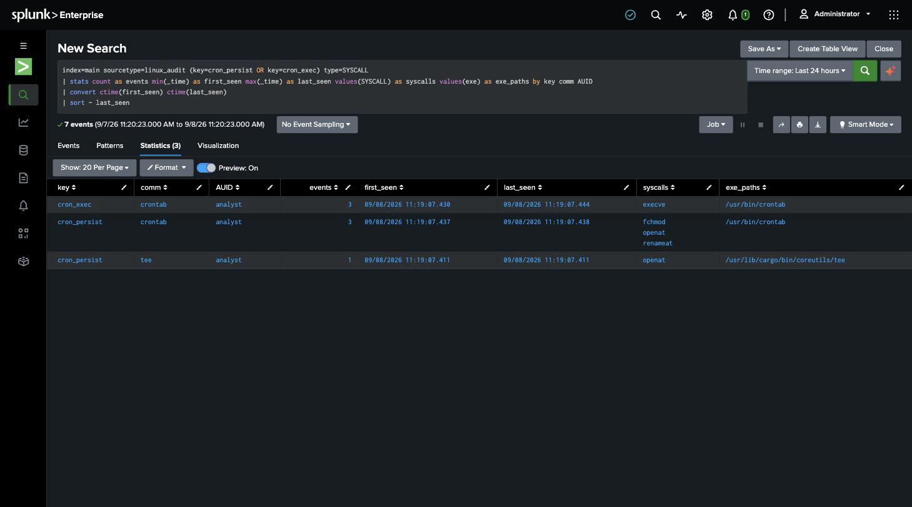
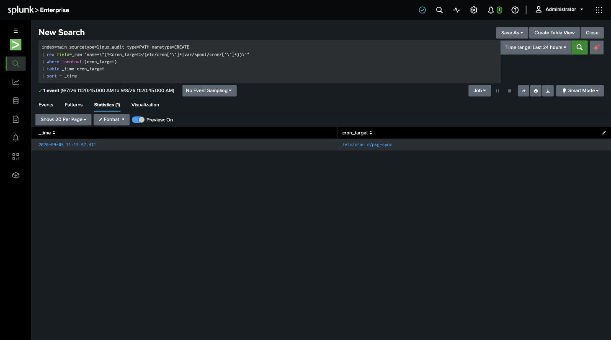

# Detection 5 — Cron Job Installed

**MITRE ATT&CK:** T1053.003 — Scheduled Task/Job: Cron
**Attack simulated:** `attack-simulations/05-cron-persistence.md`
**Log source:** `linux_audit` (`/var/log/audit/audit.log`)
**Requires:** `detections/audit-rules/50-cron.rules` loaded on the host
(`setup/03-auditd-instrumentation.md`)

Two searches. The first is the alert — *something touched cron*. The second answers the
immediate next question — *which file*.

## Search A — cron activity by actor

```spl
index=main sourcetype=linux_audit (key=cron_persist OR key=cron_exec) type=SYSCALL
| stats count as events, min(_time) as first_seen, max(_time) as last_seen,
        values(SYSCALL) as syscalls, values(exe) as exe_paths
        by key, comm, AUID
| convert ctime(first_seen) ctime(last_seen)
| sort - last_seen
```

`type=SYSCALL` filters out the `CONFIG_CHANGE` / `op=add_rule` records that fire when the
audit rules themselves are loaded — otherwise instrumenting the box would show up here as
activity. Grouping by `AUID` (the audit login UID, not the effective UID) keeps the real
user attached through `sudo`.

Against the simulated attack — three rows:

| key | comm | AUID | syscalls | exe_paths |
|---|---|---|---|---|
| cron_exec | crontab | analyst | execve | /usr/bin/crontab |
| cron_persist | crontab | analyst | fchmod, openat, renameat | /usr/bin/crontab |
| cron_persist | tee | analyst | openat | /usr/lib/cargo/bin/coreutils/tee |

The `tee` row is the `/etc/cron.d/` drop; the two `crontab` rows are the user-crontab
write. A normal `crontab -l` (just listing) would show only `cron_exec` with an `execve`
and no `cron_persist` — the write keys are what separate "looked at cron" from "changed
cron".



## Search B — which cron file was created

```spl
index=main sourcetype=linux_audit type=PATH nametype=CREATE
| rex field=_raw "name=\"(?<cron_target>/(etc/cron[^\"]*|var/spool/cron/[^\"]*))\""
| where isnotnull(cron_target)
| table _time cron_target
| sort - _time
```

Against the simulated attack — one row, `_time … /etc/cron.d/pkg-sync`. This is the
file to pull and read; the payload line inside it (`curl … | bash` as root, every 5
minutes) is the confirmation it's hostile.



## Why auditd here instead of syslog

Cron *running* a job logs to syslog (`CRON[pid]: (root) CMD (...)`), so a syslog-only
detection would catch `pkg-sync` — but not for five minutes, and not at all for the
user-crontab entry until its schedule hits. The auditd file watch fires the instant the
job is **written**, which is the point of intervention. Syslog tells you the persistence
already ran; auditd tells you it was just installed.

## False positives to expect

- **Package installs and updates.** `apt` drops and removes files in `/etc/cron.d/`
  routinely (`e2scrub_all` is already there from the base install). The signal isn't
  "a cron file changed" on its own — it's the pairing with `comm`/`AUID`: a human on an
  interactive session (`AUID` = a real user, not `unset`/`4294967295`) writing cron
  outside a package transaction is the case worth paging on. A real deployment would
  suppress writes whose parent process is `dpkg`/`apt`.
- **Legitimate admin scheduling.** Same call as detection 2 — the rule's job is to
  surface every install for a human, not to prove intent. Cron changes are rare enough
  on a fixed-purpose host that alert-on-every-occurrence is reasonable.
- **Config-management tools** (Ansible `cron` module, Puppet) write these paths on every
  run. Allowlist their service account's `AUID` if they're in use.

## Honest gap

Search A and Search B aren't joined — A says cron was touched, B lists cron files
created, and a human reads them together. Stitching them into one row means correlating
the `SYSCALL` and `PATH` records on their shared `audit()` event ID, which Splunk's
default `linux_audit` parsing doesn't do. A `props/transforms` change on the indexer to
merge auditd records would let this be a single search; noted, not done.
