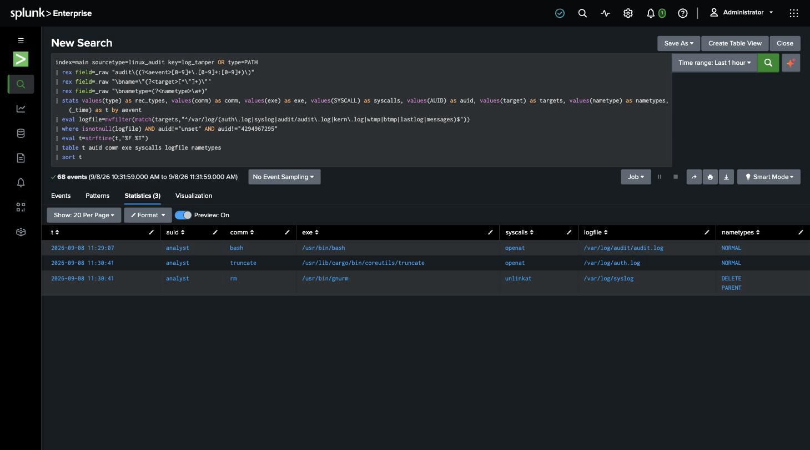

# Detection 6 — System Log Truncated or Deleted

**MITRE ATT&CK:** T1070.002 — Indicator Removal: Clear Linux or Mac System Logs
**Attack simulated:** `attack-simulations/06-log-clearing.md`
**Log source:** `linux_audit` (`/var/log/audit/audit.log`)
**Requires:** `detections/audit-rules/60-logclear.rules` loaded on the host
(`setup/03-auditd-instrumentation.md`)

## The search

```spl
index=main sourcetype=linux_audit (key=log_tamper OR type=PATH)
| rex field=_raw "audit\((?<aevent>[0-9]+\.[0-9]+:[0-9]+)\)"
| rex field=_raw "\bname=\"(?<target>[^\"]+)\""
| rex field=_raw "\bnametype=(?<nametype>\w+)"
| stats values(comm) as comm, values(exe) as exe, values(SYSCALL) as syscalls,
        values(AUID) as auid, values(target) as targets, values(nametype) as nametypes,
        min(_time) as _time
        by aevent
| eval logfile=mvfilter(match(targets,"^/var/log/(auth\.log|syslog|audit/audit\.log|kern\.log|wtmp|btmp|lastlog|messages)$"))
| where isnotnull(logfile) AND auid!="unset" AND auid!="4294967295"
| table _time auid comm exe syscalls logfile nametypes
| sort _time
```

An auditd event is several records (`SYSCALL`, `PATH`, `CWD`, `PROCTITLE`) that Splunk
indexes as separate events sharing one `audit(epoch:serial)` id. The search pulls that
id off every record with `rex`, `stats … by aevent` to reassemble the event, then keeps
only the ones that (a) touched a real system log file and (b) were driven by a login
user (`AUID` set, not `unset` / `4294967295`).

## What it catches

Any truncate, delete, or `O_TRUNC` open of a tracked log file by a process with a real
audit login UID. Against the simulated attack — three rows, one per verb:

| _time | auid | comm | syscall | logfile | nametypes |
|---|---|---|---|---|---|
| 11:29:07 | analyst | bash | openat | /var/log/audit/audit.log | NORMAL |
| 11:30:41 | analyst | truncate | openat | /var/log/auth.log | NORMAL |
| 11:30:41 | analyst | rm | unlinkat | /var/log/syslog | DELETE, PARENT |



The `AUID` is the whole point of the rule. Every command ran through `sudo`, so `uid`/
`euid` are `root` — useless for attribution. `AUID`, the login UID the kernel stamps at
session start, stays `analyst` through the privilege change and names the person.

## Why the `AUID` filter matters — the false positives it removes

Running the search without `auid!="unset"` adds two kinds of legitimate noise that were
in the real lab data:

- **`rsyslogd` recreating `syslog` and `auth.log`** right after the `rm`, on the service
  restart. `comm=rsyslogd`, `AUID=unset` — a daemon started by init has no login UID.
- **`logrotate`, `journald`, and MOTD tools** (`landscape-sysinfo` writes
  `/var/log/landscape/sysinfo.log` on login) touch `/var/log` constantly. The
  `landscape-sysinfo` write actually *does* carry `AUID=analyst` because it fires inside
  the SSH login session — which is why the search also pins the target to a specific
  list of security-relevant log files, not all of `/var/log`.

## False positives still to expect

- **A sysadmin manually rotating or clearing a log.** Legitimate but rare, and worth a
  human look every time on a fixed-purpose host — same rare-event logic as detection 2.
- **`logrotate` run interactively** (`sudo logrotate -f`) would show `AUID` set and a
  truncate of a tracked file. Cross-check whether `comm` is `logrotate` and whether it
  ran on schedule.

## Threshold notes

No threshold — `count > 0` in the window. Destroying a security log is not a
volume-based signal; one occurrence is the incident.

## Honest gap

- **Depends on the audit log surviving.** If the attacker truncates
  `/var/log/audit/audit.log` *first* and it hasn't been shipped yet, the records for
  every other clear can go with it (this happened on the first attack run — see the
  attack write-up). Real-time forwarding to a separate indexer is the mitigation; this
  detection assumes it's in place.
- **No log-silence complement.** Alerting when a source stops producing needs a traffic
  baseline the lab doesn't have. That's the other half of catching T1070.002 and it's
  not built here.
