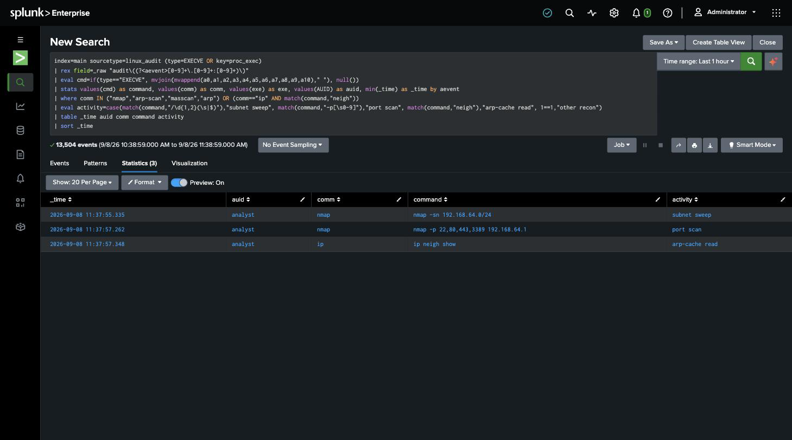

# Detection 7 — Network Scanning / Remote Host Enumeration

**MITRE ATT&CK:** T1018 — Remote System Discovery
**Attack simulated:** `attack-simulations/07-remote-discovery.md`
**Log source:** `linux_audit` (`/var/log/audit/audit.log`)
**Requires:** `detections/audit-rules/70-discovery.rules` loaded on the host
(`setup/03-auditd-instrumentation.md`)

## The search

```spl
index=main sourcetype=linux_audit (type=EXECVE OR key=proc_exec)
| rex field=_raw "audit\((?<aevent>[0-9]+\.[0-9]+:[0-9]+)\)"
| eval cmd=if(type=="EXECVE", mvjoin(mvappend(a0,a1,a2,a3,a4,a5,a6,a7,a8,a9,a10)," "), null())
| stats values(cmd) as command, values(comm) as comm, values(exe) as exe,
        values(AUID) as auid, min(_time) as _time
        by aevent
| where comm IN ("nmap","arp-scan","masscan","arp","zmap","fping")
      OR (comm=="ip" AND match(command,"neigh"))
| eval activity=case(match(command,"/\d{1,2}(\s|$)"),"subnet sweep",
                     match(command,"-p[\s0-9]"),"port scan",
                     match(command,"neigh"),"arp-cache read",
                     1==1,"other recon")
| table _time auid comm command activity
| sort _time
```

`EXECVE` and `SYSCALL` are separate Splunk events sharing one `audit()` id. The search
stitches them by that id so each row has both the full command (`EXECVE`) and the actor
(`AUID`, from `SYSCALL`). `if(type=="EXECVE", …)` keeps the `SYSCALL` record's hex
register values out of the rebuilt command string.

## What it catches

Execution of a network-scanner binary, or an ARP-cache read, by any user. Against the
simulated attack — three rows:

| _time | auid | comm | command | activity |
|---|---|---|---|---|
| 11:37:55 | analyst | nmap | `nmap -sn 192.168.64.0/24` | subnet sweep |
| 11:37:57 | analyst | nmap | `nmap -p 22,80,443,3389 192.168.64.1` | port scan |
| 11:37:57 | analyst | ip | `ip neigh show` | arp-cache read |



The event count on that search is ~13,500 — the whole `proc_exec` feed for the window.
Three of those are the recon. That ratio is the point of the detection: the signal is a
handful of commands in a flood of routine process execution, and the filter is what
makes it a detection instead of a haystack.

## Two ways to identify recon, and why both

1. **Binary name** (`comm IN (nmap, masscan, …)`) — catches the common scanners
   outright.
2. **Argument shape** (`activity` eval: a CIDR like `/24`, a `-p` port list) — describes
   *what kind* of scan, and is the seed of a stealthier detection that keys on
   "command line contains a network range" regardless of the binary.

The lab uses (1) as the gate and (2) as enrichment. A real deployment would lean harder
on (2), plus a rate signal (one process opening connections to many hosts in seconds).

## False positives to expect

- **Legitimate use of `nmap` by admins** doing their own network checks. On a
  fixed-purpose server that should be rare enough to review each time; allowlist a
  jump-host source or a named admin `AUID` if it's routine.
- **Monitoring and asset-inventory tools** (Nagios, `nmap`-based discovery scripts,
  `arp-scan` in a cron job) will trip this. Allowlist their service-account `AUID` /
  parent process.
- **`ip neigh` / `arp -a`** are run constantly by scripts and humans. Included here only
  because it's part of an obvious burst; standalone it's not worth an alert.

## Threshold notes

No threshold on the binary-name match — running `nmap` on a server that has no reason to
is worth one look. The rate-based variant (many destinations, short window) would carry
a threshold tuned to the environment.

## Honest gap

- **Scanner-by-name only.** Enumeration done with shell built-ins (`for i in $(seq …);
  do ping -c1 …`) never runs a scanner binary and sails past rule (1). Catching that
  needs the rate signal — count distinct destination IPs per process per minute — which
  isn't built here.
- **No correlation to a network-flow source.** This detection sees the command, not the
  packets. Pairing it with connection logs (a burst of SYNs to sequential addresses)
  would confirm the scan actually ran and what it found.
