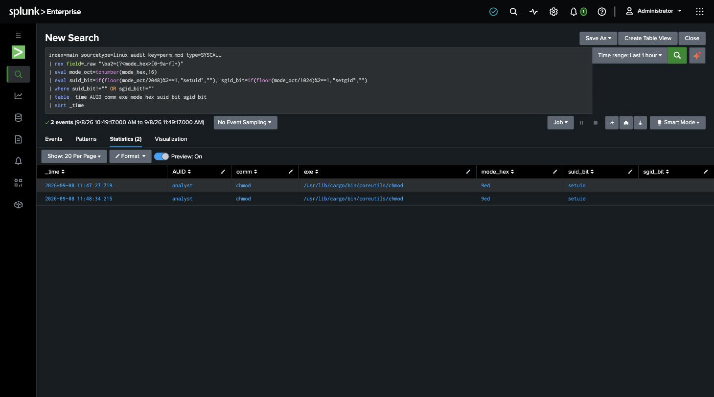
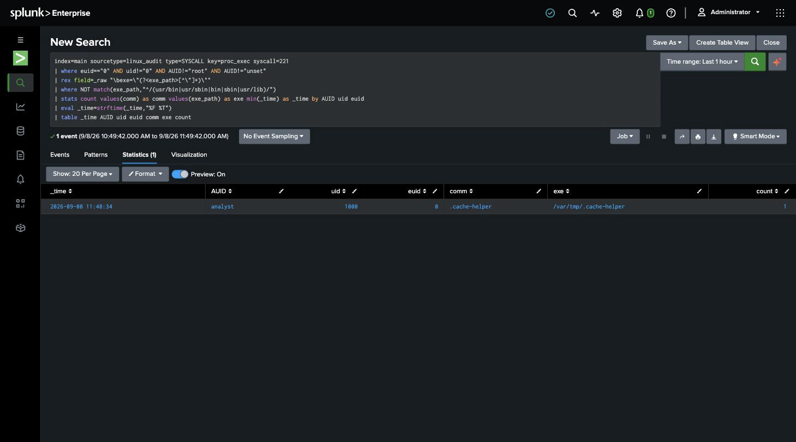

# Detection 8 — Setuid/Setgid Bit Set, and Elevated Execution

**MITRE ATT&CK:** T1548.001 — Abuse Elevation Control Mechanism: Setuid and Setgid
**Attack simulated:** `attack-simulations/08-setuid-abuse.md`
**Log source:** `linux_audit` (`/var/log/audit/audit.log`)
**Requires:** `detections/audit-rules/80-privesc.rules` + the `proc_exec` feed from
`70-discovery.rules` (`setup/03-auditd-instrumentation.md`)

Two searches, one per half of the technique: setting the bit, and using it.

## Search A — a chmod that sets setuid or setgid

```spl
index=main sourcetype=linux_audit key=perm_mod type=SYSCALL
| rex field=_raw "\ba2=(?<mode_hex>[0-9a-f]+)"
| eval mode_oct=tonumber(mode_hex,16)
| eval suid_bit=if(floor(mode_oct/2048)%2==1,"setuid",""),
       sgid_bit=if(floor(mode_oct/1024)%2==1,"setgid","")
| where suid_bit!="" OR sgid_bit!=""
| table _time AUID comm exe mode_hex suid_bit sgid_bit
| sort _time
```

`fchmodat`'s mode argument is `a2`, logged in hex. Convert it, then test the setuid
(`04000` → the 2048 place) and setgid (`02000` → the 1024 place) bits directly. Against
the simulated attack — two rows (the two `chmod 4755` runs), `mode_hex=9ed`,
`suid_bit=setuid`, `AUID=analyst`.



## Search B — a process running as root it wasn't launched as

```spl
index=main sourcetype=linux_audit type=SYSCALL key=proc_exec syscall=221
| where euid=="0" AND uid!="0" AND AUID!="root" AND AUID!="unset"
| rex field=_raw "\bexe=\"(?<exe_path>[^\"]+)\""
| where NOT match(exe_path,"^/(usr/bin|usr/sbin|bin|sbin|usr/lib)/")
| stats count, values(comm) as comm, values(exe_path) as exe, min(_time) as _time
        by AUID uid euid
| sort - count
```

On an `execve`, `uid` is the caller's real UID and `euid` is what the process ends up
running as. `euid=0` with `uid` still `1000` means something granted root mid-exec —
a setuid-root binary. Excluding the standard binary directories drops the legitimate
setuid tools (`sudo`, `passwd`, `mount`, `pkexec`, …) that live in `/usr/bin` etc. and
leaves the ones running from odd places.

Against the simulated attack — one row: `AUID=analyst`, `uid=1000`, `euid=0`,
`comm=.cache-helper`, `exe=/var/tmp/.cache-helper`.



## Why both

Search A catches the setup — it fires the moment the bit is set, before the binary is
ever run, which is the earliest possible intervention. Search B catches the use, and
also catches a setuid binary that was planted some other way (unpacked from an archive,
dropped by another exploit) and never went through a watched `chmod`. Neither alone is
complete.

## False positives to expect

- **Package managers.** `dpkg` / `rpm` set setuid bits on real system binaries during
  install (`/usr/bin/sudo`, `newgrp`, `chsh`). Search A would show `comm=dpkg` and a
  target under `/usr/bin` — suppress on the parent being a package transaction, or on
  the target path being a known system binary.
- **Legitimate setuid tools in `/usr/bin`** are already excluded from Search B by the
  path filter. If an environment keeps custom setuid helpers elsewhere (`/opt/app/bin`),
  allowlist those specific paths rather than widening the filter.
- **`chsh` / `passwd` run by a normal user** show up in Search B (`euid=0`, from
  `/usr/bin`) and are excluded by the path filter — correctly, that's normal.

## Threshold notes

No threshold on either search. A setuid bit appearing on a non-package file, or a root
process launched from `/var/tmp`, is worth a look every single time on a fixed-purpose
host.

## Honest gap

- **No known-good setuid inventory.** The strongest version of this detection diffs the
  box's current setuid binaries against a baseline captured at build time (same pattern
  as detection 3's `known_services.csv`). That catches a planted binary regardless of
  how it got there and regardless of whether it's been run yet. Not built here —
  Search A + B cover the `chmod` path and the execution path, which is where this lab's
  simulated attack lives.
- **`mode_hex` parsing assumes `a2` is the mode.** True for `fchmodat`; `fchmod` puts
  the mode in `a1`. A complete rule set would normalise per syscall.
