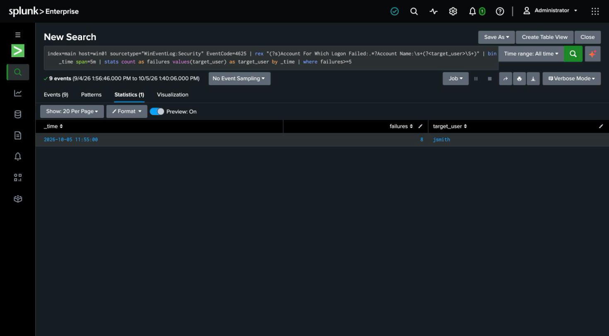

# Detection 9 — Windows Password Brute Force

**MITRE ATT&CK:** T1110.001 — Brute Force: Password Guessing
**Attack simulated:** `attack-simulations/09-windows-brute-force.md`
**Log source:** `WinEventLog:Security` (EventCode 4625), host `win01`

## The search

```spl
index=main host=win01 sourcetype="WinEventLog:Security" EventCode=4625
| rex "(?s)Account For Which Logon Failed:.*?Account Name:\s+(?<target_user>\S+)"
| bin _time span=5m
| stats count as failures values(target_user) as target_user by _time
| where failures >= 5
```

Same **rate** shape as the Linux SSH brute-force detection (detection 1): bucket failed
logons into 5-minute windows and alert when one account crosses a threshold. Only the
plumbing changes — `EventCode=4625` instead of `sshd` lines, and the target username
parsed out of the "Account For Which Logon Failed" block of the event message.

## Why the message is parsed, not a field

This lab runs a bare Splunk indexer with no Splunk Add-on for Windows, so Security events
arrive as their rendered message text rather than tidy key-value fields. The account name
lives in the message body (`Account For Which Logon Failed: … Account Name: jsmith`), so
the detection `rex`-extracts it. On a production deployment the add-on would field this for
you; doing it by hand here shows what the add-on is actually doing.

## What it catches

Against the simulated attack: one row, `target_user=jsmith`, `failures=8` in a single
5-minute bucket.

## False positives to expect

- **A user fat-fingering their password** a few times then succeeding. The threshold (5)
  and the window keep single typos quiet, but a genuinely forgetful user can still trip it
  — which is correct: a burst of failures is worth a glance, and a paired success (see
  detection 4's Linux equivalent) is what separates "locked myself out" from "someone got
  in."
- **Service accounts with a stale cached password** hammering a logon in a loop — a classic
  real-world 4625 flood that has nothing to do with an attacker.

## Honest gap

Logon type 2 (interactive, as generated here via `LogonUser`) doesn't always carry a
source network address, so this version keys on the **account**, not the source. A
network-facing brute force (type 3) would populate `Source Network Address`, and a
stronger version would also group by source IP to catch one attacker spraying many
usernames — the Windows analogue of password spraying.

## Screenshot


