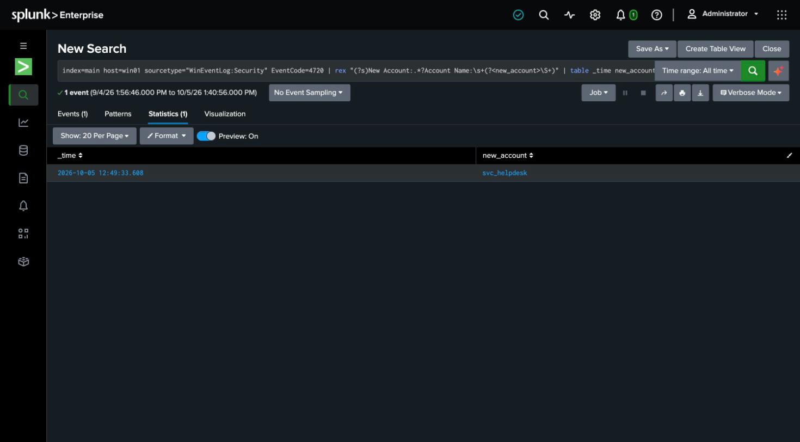

# Detection 10 — New Local Account Created (Windows)

**MITRE ATT&CK:** T1136.001 — Create Account: Local Account
**Attack simulated:** `attack-simulations/10-windows-new-account.md`
**Log source:** `WinEventLog:Security` (EventCode 4720), host `win01`

## The search

```spl
index=main host=win01 sourcetype="WinEventLog:Security" EventCode=4720
| rex "(?s)New Account:.*?Account Name:\s+(?<new_account>\S+)"
| table _time new_account
```

The Windows twin of the Linux new-account detection (detection 2), and the same
**rare-event** shape: account creation is infrequent enough that every occurrence is worth
a human look, so the rule is "any 4720," not a threshold.

## What it catches

Against the simulated attack: `new_account=svc_helpdesk` — the one account-creation event
in the window, surfaced with no threshold to tune.

The rare-event design is the point: in a single-user host (and most small real
environments) new local accounts are infrequent enough that *every* one deserves a human
look, so the rule alerts on the event itself, not on a rate. The Linux twin (detection 2)
made the same case from the other direction — it caught the forwarder's own `splunkfwd`
account that install had created, proving the design surfaces legitimate provisioning too,
which is exactly what you want a human to confirm rather than the detection to guess.

## Prerequisite: audit policy

4720 only exists if **User Account Management** auditing is enabled
(`auditpol /set /subcategory:"User Account Management" /success:enable`). On a host where
it was never turned on, this attack is invisible — the detection is only as good as the
logging behind it, which is itself worth stating in a report.

## False positives to expect

- **Legitimate provisioning** — a new employee, or a tool like an MDM/RMM creating a
  service account — trips this identically. As with the Linux version, the detection's job
  isn't to prove malice, it's to make every account-creation event visible.

## Honest gap

This fires on local-account creation only. Domain-account creation shows up on a domain
controller, not here, and this single-host lab has no domain — a real environment would
pull 4720/4741 from the DCs as well.

## Screenshot


