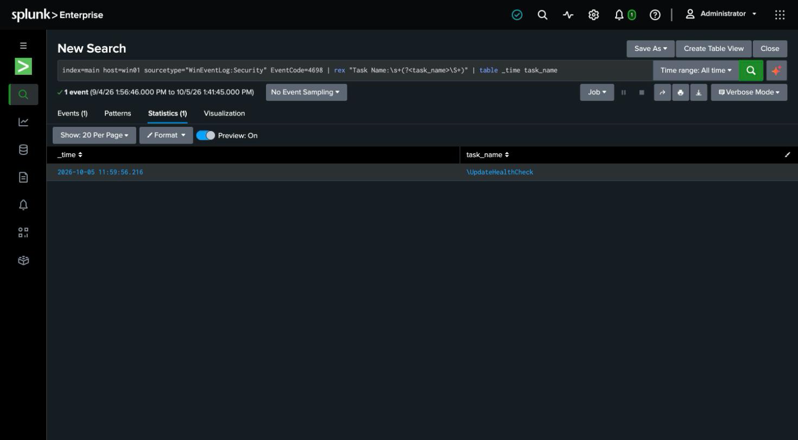

# Detection 11 — Scheduled Task Persistence

**MITRE ATT&CK:** T1053.005 — Scheduled Task/Job: Scheduled Task
**Attack simulated:** `attack-simulations/11-scheduled-task.md`
**Log source:** `WinEventLog:Security` (EventCode 4698), host `win01`

## The search

```spl
index=main host=win01 sourcetype="WinEventLog:Security" EventCode=4698
| rex "Task Name:\s+(?<task_name>\\\S+)"
| table _time task_name
```

An **allowlist / rare-event** shape, like the Linux systemd detection (detection 3): on a
stable host, new scheduled tasks are uncommon, and the names of the legitimate ones are
knowable — so a task outside that known-good set is worth surfacing.

## What it catches

Against the simulated attack: `task_name=\UpdateHealthCheck`.

## Corroboration with Sysmon

The same action also produced a **Sysmon event 1** for `schtasks.exe` with its full command
line. Two independent records — the Security-log task-creation audit and the process that
created it — means that even if one source is tampered with or unavailable, the other still
carries the evidence. The correlation layer can lean on either.

## Prerequisite: audit policy

4698 depends on the **Other Object Access Events** subcategory, which is off by default.
Enable with `auditpol /set /subcategory:"Other Object Access Events" /success:enable`.

## False positives to expect

- **Windows and vendor software create scheduled tasks legitimately** — updaters, telemetry,
  maintenance. A production version should baseline the existing `\Microsoft\Windows\*`
  tasks and alert on tasks created *outside* that tree, or on tasks whose action is a
  script interpreter (`cmd`, `powershell`, `wscript`) — which is the attacker-interesting
  signal, and matches the `-tr "cmd.exe /c …"` used here.

## Honest gap

This keys on the task name only. A stronger rule would parse the task's **action** (the
command it runs) and its **principal** (it ran as `SYSTEM` here), both of which are richer
signals than the name an attacker fully controls.

## Screenshot


