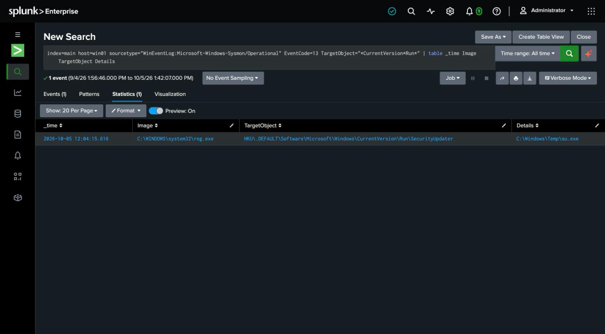

# Detection 12 — Registry Run Key Persistence

**MITRE ATT&CK:** T1547.001 — Boot or Logon Autostart Execution: Registry Run Keys
**Attack simulated:** `attack-simulations/12-run-key-persistence.md`
**Log source:** `WinEventLog:Microsoft-Windows-Sysmon/Operational` (EventCode 13), host `win01`

## The search

```spl
index=main host=win01 sourcetype="WinEventLog:Microsoft-Windows-Sysmon/Operational" EventCode=13
    TargetObject="*\\CurrentVersion\\Run\\*"
| table _time Image TargetObject Details
```

A **rare-event by location** shape: rather than trying to judge whether a value is
malicious, it watches a small set of high-value registry locations (the autostart `Run`
keys) and surfaces any write to them. There's no Windows Security-log event for this — it
relies entirely on **Sysmon event 13 (registry value set)**, which is why enabling Sysmon
registry auditing is part of the build.

## What it catches

Against the simulated attack: `Image=reg.exe`,
`TargetObject=HKU\.DEFAULT\Software\Microsoft\Windows\CurrentVersion\Run\SecurityUpdater`,
`Details=C:\Windows\Temp\su.exe`.

The `*\\CurrentVersion\\Run\\*` match is deliberately hive-agnostic — it catches the write
whether it lands in `HKLM`, a user's `HKU\<SID>`, or (as here, because the simulation ran
as SYSTEM) `HKU\.DEFAULT`. An attacker will write wherever they have access, so the
detection shouldn't assume a hive.

## False positives to expect

- **Legitimate software registers Run keys** — plenty of installers and updaters add
  autostart entries. A production version baselines the expected `Run` values and alerts on
  new or changed ones, and pays special attention to `Details` pointing at
  `C:\Windows\Temp`, `%APPDATA%`, or `%PUBLIC%` (as here) rather than a normal install path.

## Honest gap

`Run` / `RunOnce` under `CurrentVersion` is the most common autostart location, but far from
the only one — services, `Winlogon` shell/userinit, `IFEO`, and scheduled tasks are all
autostart vectors. This covers the single most abused key, not the full
[ASEP](https://attack.mitre.org/techniques/T1547/) surface.

## Screenshot


