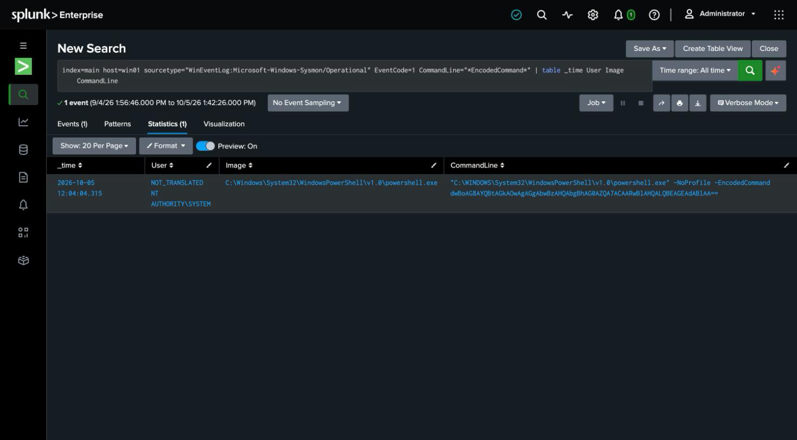

# Detection 13 — Encoded PowerShell Execution

**MITRE ATT&CK:** T1059.001 — Command and Scripting Interpreter: PowerShell
**Attack simulated:** `attack-simulations/13-encoded-powershell.md`
**Log source:** `WinEventLog:Microsoft-Windows-Sysmon/Operational` (EventCode 1), host `win01`

## The search

```spl
index=main host=win01 sourcetype="WinEventLog:Microsoft-Windows-Sysmon/Operational" EventCode=1
    (CommandLine="*-enc *" OR CommandLine="*-encodedcommand*" OR CommandLine="*-ec *")
| table _time User Image ParentImage CommandLine
```

A **command-line pattern** shape — new to this lab, and a staple of real detection. It
keys on the shape of the invocation, not a decoded payload: `powershell.exe` with an
`-EncodedCommand` (or its `-enc` / `-ec` abbreviations) argument. Sysmon event 1 captures
the full command line of every process, which is what makes this possible.

## What it catches

Against the simulated attack: the `powershell.exe` process with `-EncodedCommand` and the
Base64 blob on its command line.

## Going further (noted, not claimed)

The high-value next step is **decoding** the Base64 at search time
(`| rex "-[eE][nNcC]*\s+(?<b64>[A-Za-z0-9+/=]+)" | eval decoded=...`) to reveal the actual
command — Splunk doesn't have a native UTF-16 Base64 decode, so this is usually handed to a
lookup or a small custom command. The lab version flags the *pattern*; turning the blob back
into readable intent is the obvious enhancement and is called out here rather than
overstated as done.

## False positives to expect

- **Legitimate tooling uses `-EncodedCommand`** — some management agents, installers, and
  GPO scripts encode commands to avoid quoting problems. The argument alone is suspicious,
  not conclusive; pairing it with a hidden window (`-WindowStyle Hidden`, as used here), an
  unusual parent process, or a decode that reveals download/exec behaviour is what turns it
  into a real alert.

## Honest gap

This catches the `-EncodedCommand` flag specifically. It does **not** catch other PowerShell
obfuscation (string concatenation, `IEX` of a downloaded string, `FromBase64String` inside
the script body). Deeper coverage wants PowerShell **Script Block Logging** (Event ID 4104),
which records the de-obfuscated script content and isn't enabled in this build.

## Screenshot


