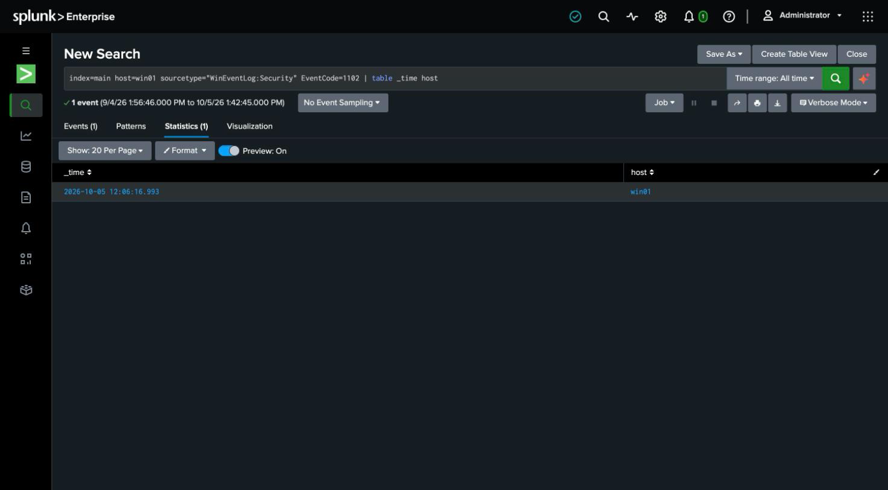

# Detection 14 — Windows Event Log Cleared

**MITRE ATT&CK:** T1070.001 — Indicator Removal: Clear Windows Event Logs
**Attack simulated:** `attack-simulations/14-clear-event-log.md`
**Log source:** `WinEventLog:Security` (EventCode 1102), host `win01`

## The search

```spl
index=main host=win01 sourcetype="WinEventLog:Security" EventCode=1102
| table _time host
```

The simplest possible rule — any 1102 is an alert — and the Windows twin of the Linux
log-clearing detection (detection 6). Clearing the Security log is not something that
happens in normal operation, so a single occurrence is high-signal.

## What it catches

Against the simulated attack: one 1102, "The audit log was cleared."

## The real lesson: the forwarded copy survives

This detection's value isn't the alert alone — it's what sits beside it. After
`wevtutil cl Security` wiped the local log, the events from attacks 9–11 (`4625`, `4720`,
`4698`) were **still queryable in Splunk**, because the forwarder had already shipped them
off-box in real time. The attacker destroyed the local record and the evidence was already
beyond reach.

That's the same thing the Linux side demonstrated when `truncate` destroyed `audit.log`
mid-run (detection 6). Real-time forwarding turns log-clearing from "evidence destroyed"
into "evidence of the destruction, plus everything they tried to destroy" — and this
Windows case shows it's a platform-independent property of the architecture, not a
Linux quirk.

## False positives to expect

- **Almost none for 1102 specifically.** Legitimate log clears are rare and usually
  deliberate (an admin resetting a log). Each one still deserves a look — the point is that
  it's a *known* action by a *known* person, which the alert lets you confirm rather than
  assume.

## Honest gap

1102 fires only for the **Security** log. Clearing other logs (System, PowerShell,
application logs) raises **event 104** in those logs instead; a complete rule would union
1102 and 104 across channels. This covers the Security log, the one an attacker most wants
gone.

## Screenshot


