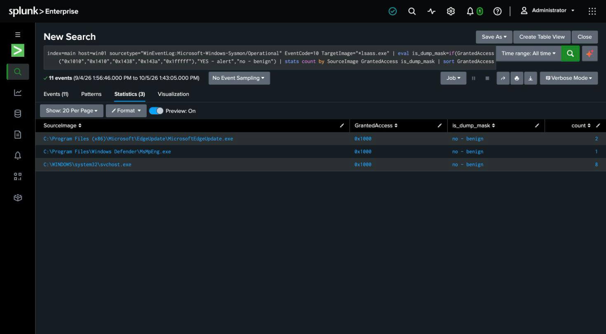

# Detection 15 — LSASS Credential-Dump Access

**MITRE ATT&CK:** T1003.001 — OS Credential Dumping: LSASS Memory
**Attack simulated:** `attack-simulations/15-lsass-access.md`
**Log source:** `WinEventLog:Microsoft-Windows-Sysmon/Operational` (EventCode 10), host `win01`
**Prerequisite:** Sysmon ProcessAccess enabled — see [`sysmon-config.md`](sysmon-config.md)

## The search

```spl
index=main host=win01 sourcetype="WinEventLog:Microsoft-Windows-Sysmon/Operational" EventCode=10
    TargetImage="*\\lsass.exe"
    GrantedAccess IN (0x1010, 0x1410, 0x1438, 0x143a, 0x1fffff)
| table _time SourceImage TargetImage GrantedAccess CallTrace
```

A **GrantedAccess-mask** detection: watch every handle opened to `lsass.exe` and alert only
when the requested access includes memory-read rights (`PROCESS_VM_READ`, `0x10`) — the
masks a credential dumper needs and that routine callers don't. This is the most
SOC-relevant technique in the set, and the most instructive, because of how it played out.

## What actually happened: three findings

**1. The technique was blocked by the OS.** Opening `lsass.exe` with the dump mask
(`0x1410`) returned handle `0`, error `5` (ACCESS_DENIED). This Windows 11 build runs LSASS
as a protected process (`RunAsPPL = 2`, on by default), so the memory-read handle is refused
and **no Sysmon 10 is generated** — there was no access to log. The detection you hope never
fires because a control upstream already stopped the technique. That's defense-in-depth, and
it's the honest headline here: on a modern, default-configured endpoint, the classic
LSASS-dump handle doesn't succeed.

**2. The monitoring was off by default.** The SwiftOnSecurity Sysmon config ships
ProcessAccess **disabled** (an empty `include` block that logs nothing) because, on a busy
host, handle opens to LSASS are constant. Detecting this technique at all first requires
turning ProcessAccess on and scoping it to LSASS — documented in
[`sysmon-config.md`](sysmon-config.md). A detection is only as real as the telemetry
beneath it.

**3. The baseline noise is exactly what the mask filter removes.** With ProcessAccess on,
the normal LSASS traffic on this host is `svchost.exe` → `lsass.exe` with `GrantedAccess
0x1000` (`PROCESS_QUERY_LIMITED_INFORMATION`) — legitimate, constant, and correctly
**excluded** by the `IN (0x1010, 0x1410, …)` filter. The filter is the detection; collecting
every LSASS handle and alerting on all of them would bury the analyst.

## Validating the logic without weakening the host

Because LSA protection (correctly) prevented a live positive, and disabling it would have
weakened a real security control, the SPL was validated against a **stand-in**: a throwaway
process opened with the identical `0x1410` dump mask, which produced a clean Sysmon 10 the
search matched on. Same event shape, same mask, no protected process touched. The stand-in
watch was then removed from the shipped config, which watches `lsass.exe` only.

## False positives to expect

- **Legitimate security and system software reads LSASS** — some EDR, backup, and
  diagnostic tools open it with broad rights. `0x1fffff` (full access) in particular is used
  by legitimate system components; a production rule tunes by `SourceImage` (allowlisting
  known-good readers) rather than on the mask alone.

## Honest gap

This is a handle-based detection, which catches the *access*, not the *theft*. A dumper that
reads LSASS through a driver, via a process clone/snapshot, or by other
protection-bypass techniques may not present as a straightforward `0x1410` open to
`lsass.exe`. And on this host the realistic attack never ran to completion — the detection
is validated in shape, with its live firing gated behind an OS control that, here, did its
job.

## Screenshot


